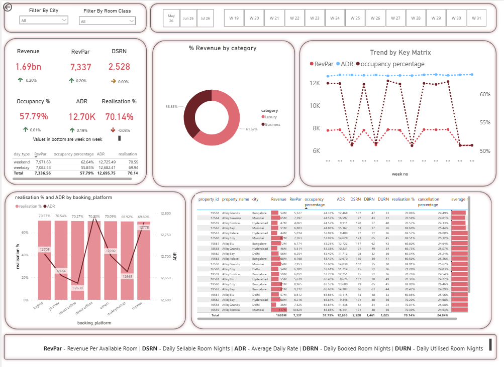
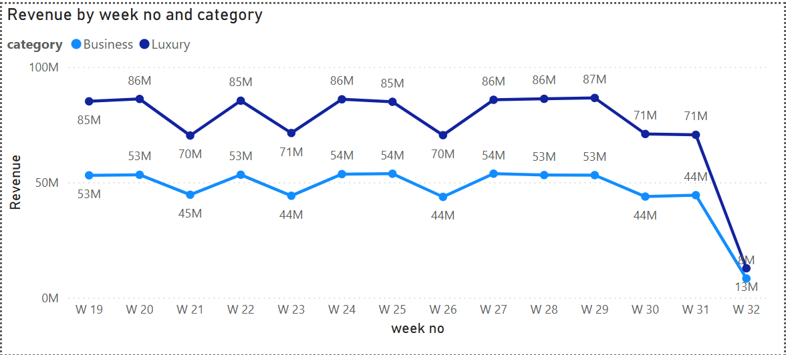
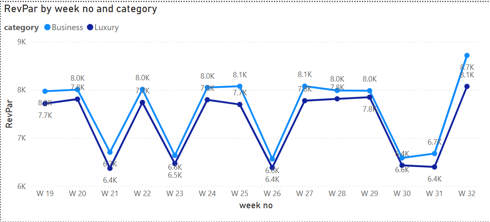
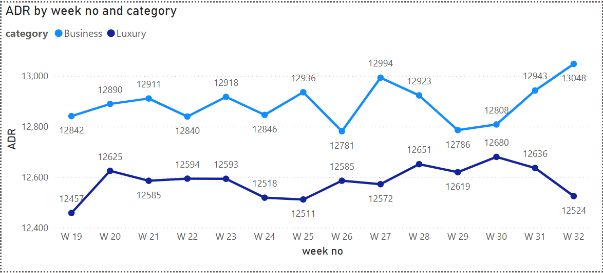
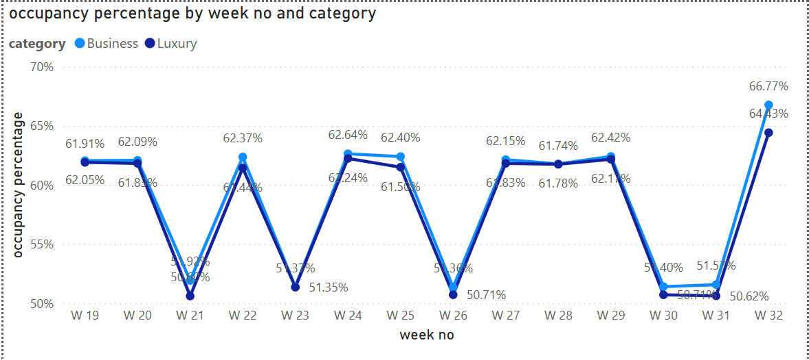
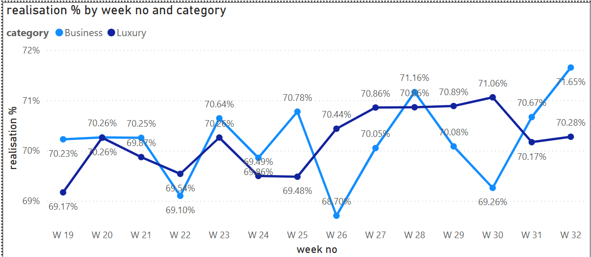
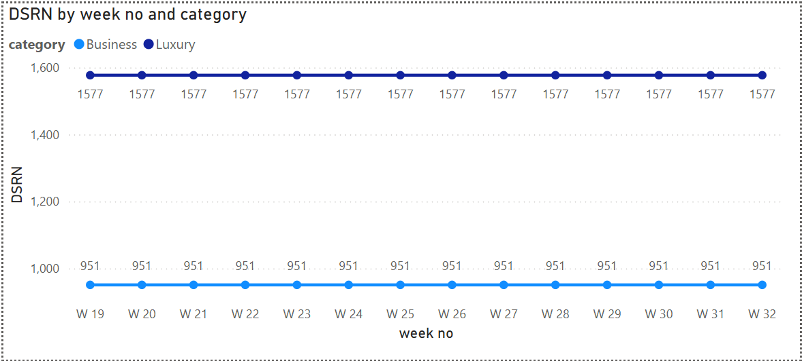

# AtliQ Hotels — Hospitality Analytics Dashboard

A Power BI dashboard built for AtliQ Hotels' revenue management team. The goal was simple: stop making pricing decisions based on gut feeling and start making them based on data.

---
## Dashboard Preview

### Trend Analysis Pages

---

## What this project is about

AtliQ Hotels runs 7 properties across 4 Indian cities — Delhi, Mumbai, Hyderabad, and Bangalore. They had booking data going back months but no real way to look at it. No one knew which properties were underperforming, whether weekend rates should be different from weekday rates, or which booking platform was actually worth the commission.

I built a dashboard that answers those questions — and then dug into what the numbers actually meant for the business.

---

## What I found

**The hotel wasn't adjusting prices at all.**
ADR (Average Daily Rate) was flat for all 13 weeks in the dataset. Occupancy went up and down every week, but the rate stayed the same. That means on busy weeks, they were leaving money on the table. RevPAR only changed because demand changed — not because anyone made a pricing decision.

**Weekends had higher occupancy but almost the same rate as weekdays.**
Weekend occupancy was 62.79% vs 56.06% on weekdays. Weekend ADR was 9,381 vs 9,294 on weekdays. That's a gap of less than 1% on rate, despite meaningfully higher demand. A 10% weekend rate increase would directly lift RevPAR with zero extra cost.

**The booking platform strategy had a problem.**
OTA platforms like MakeMyTrip use bots that monitor pricing. If the hotel lists lower prices anywhere else, the OTA reduces their visibility. So cutting direct website prices isn't actually cheaper — it costs you OTA ranking. The better play is offering coupons on the direct channel instead of reducing the listed price.

**Atliq Grands Bangalore was the worst performer by a distance.**
Lowest occupancy in the entire dataset. Average guest rating of 2.33 out of 5. Across every property in the data, higher ratings consistently tracked with better occupancy. This one needs a root cause analysis on reviews — not a pricing fix.

---

## Dataset

5 CSV files, ~134,000 booking records, covering May–July 2022.

| File | What's in it |
|------|-------------|
| `dim_date.csv` | Calendar with week numbers and weekend/weekday labels |
| `dim_hotels.csv` | 7 properties — name, city, category (Luxury/Business) |
| `dim_rooms.csv` | 4 room types mapped to room classes |
| `fact_aggregated_bookings.csv` | Daily capacity and bookings per room type per property |
| `fact_bookings.csv` | Individual booking records with revenue, platform, status, ratings |

---

## KPIs tracked

RevPAR, ADR, Occupancy %, DSRN, DBRN, DURN, Realisation %, Cancellation Rate — all calculated using DAX in Power BI. Week-on-week change indicators for each metric.

---

## Tools

- Power BI Desktop
- DAX
- Excel (initial data exploration)

---

## Files in this repo

- `AtliQ_Hospitality_Analytics.pptx` — stakeholder presentation with all 4 insights and recommendations
- `AtliQ_Problem_Statement.docx` — full project scope, dataset description, and KPI definitions
- `meta_data_hospitality.txt` — column descriptions for all tables
- `data/` — 5 raw CSV files (dim_date, dim_hotels, dim_rooms, fact_aggregated_bookings, fact_bookings)
- `metrics list.xlsx — List of all the metrics used in the project
- `screenshots/` — screenshots of the dashbaord for the project

---

## reference
Built on the Codebasics hospitality dataset, extended with additional business analysis and recommendations beyond the guided project.

---
